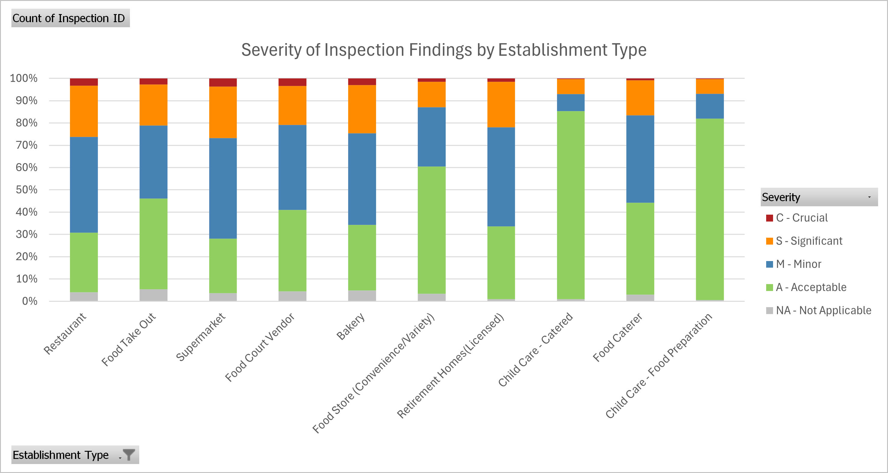
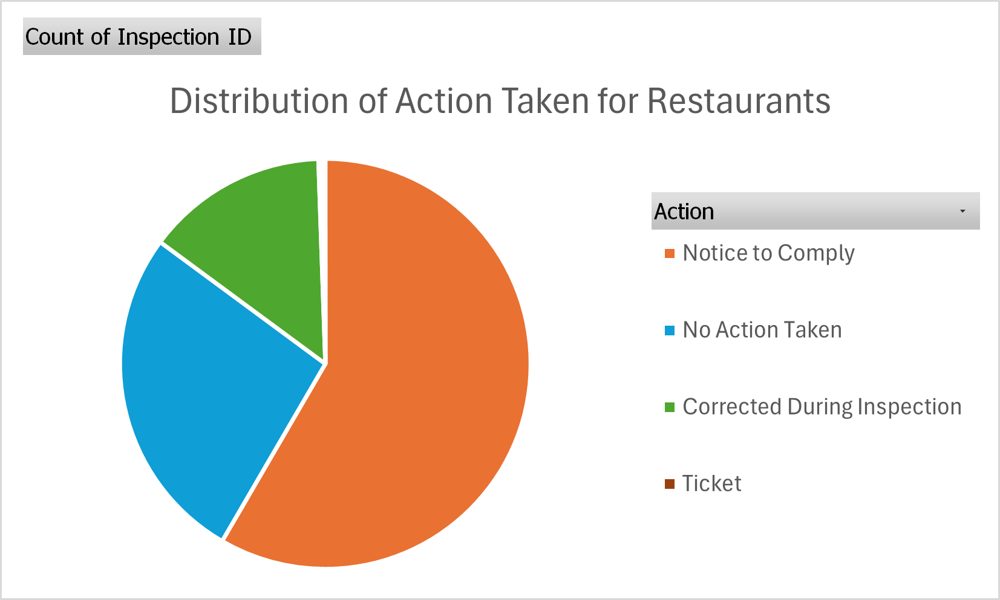
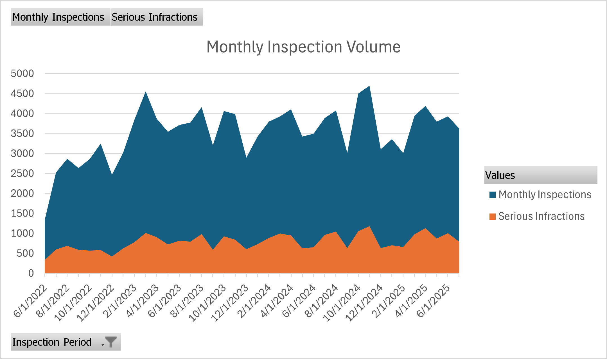

# DineSafe Toronto


DineSafe Toronto is a data science projected focused on analyzing food safety inspections conducted by Toronto Public Health. We explore temporal trends, establishment characteristics, neighborhood distributions, as well as patterns in infractions, severity levels, location, and operations.

You've may seen these posters displayed near the entrance of restaurants across Toronto. Issued by Toronto Public Health, they signal results of recent food safety inspections:

| Pass Notice | Conditional Notice | Closed Notice |
|----------------------|-----------------------------|------------------------|
|  |  |  |

These notices aren't just stickers. They're data points. This project dives into the inspection records behind them to uncover trends, risks, and insights across Toronto's vibrant food landscape.

## Objectives
- Identify high-risk establishments and repeated violators
- Flag crucial and serious infractions
- Analyze trends by time, geography, and establishment type

## Workflow
1. Data Acquisition & Cleaning
   - Download latest DineSafe CSVs (`download_data.py`)
   - Clean and pre-process using Python (`01_eda.ipynb`)
2. Feature Engineering
   - Create time-based features (inspection month/year/period)
   - Flag infractions, severity, actions, fines
   - Aggregate inspection counts and infraction rates per establishment
3. Export for Excel & Power BI
   - Save processed data to CSV for easy import into Excel and Power BI
   - Visualize trends and risk scores in Power BI dashboards

## Excel \& Power BI Dashboards
In addition to Python-based data cleaning and feature engineering, this project delivers stakeholder-ready reporting using Excel and Power BI.

### Excel Dashboard
- KPIs: Total inspections, Serious infraction rate
- Monthly trend of inspections and violations
- Establishment segmentation by type and severity
- Enforcement outcomes (fines and actions)

<p align="center">
  
</p>

<p align="center">
  
</p>

<p align="center">
  
</p>

Download a demo workbook:  
[**DineSafe_Dashboard.xlsx**](reports/DineSafe_Dashboard.xlsx)


> Note: This workbook contains a reduced sample (~500–1000 rows) for GitHub demo purposes.  
> The full dataset (130k+ rows) is publicly available from the [City of Toronto Open Data Portal](https://open.toronto.ca/dataset/dinesafe/). Alternatively, `download_data.py` automatically grabs the latest dataset from the same portal.

### Power BI Dashboard
- Interactive map of infractions by severity
- Filters for year, establishment type, and severity
- Tree map of inspections by establishment type

## Repository Structure
```
data/
  raw/         # Original DineSafe CSVs
  processed/   # Cleaned and feature-engineered CSVs
  excel/       # Excel-specific CSVs
notebooks/
  01_eda.ipynb             # Exploratory Data Analysis
  02_feature_engineering.ipynb # Feature engineering steps
  assets/                  # Charts and images for reporting
src/
  download_data.py         # Script to fetch latest data
notes/
  01_ckan_api_explained.md # API documentation and notes
reports/
  DineSafe_Dashboard.xlsx           # demo workbook (small sample)
  excel_dashboard_screenshots/      # screenshots of key visuals
README.md                  # Project documentation
requirements.txt           # Python dependencies
```


## Example Visual from Python
<p align="center">  </p>


## How to Run

### 1. Clone the repository
```bash
git clone https://github.com/notexploiting/dinesafe-toronto.git
cd dinesafe-toronto
```

### 2. Create and Activate a Virtual Environment
**Windows**:
```bash
python -m venv .venv
.venv\Scripts\activate
```
**macOS/Linux**:
```bash
python3 -m venv .venv
source .venv/bin/activate
```

### 3. Install Dependencies
```bash
pip install -r requirements.txt
```

### 4. Download the dataset
```bash
python src/download_data.py
```

### 5. Run the EDA notebook
Open & Run All Chunks `notebooks/01_eda.ipynb` in Jupyter or VSCode

### 6. Run the Feature Engineering notebook
Open & Run All Chunks `notebooks/02_feature_engineering.ipynb` in Jupyter or VSCode

### Every Time You Work on the Project
1. Open VSCode in the project folder
2. Activate the virtual environment
**Windows**:
```bash
.venv\Scripts\activate
```
**macOS/Linux**:
```bash
source .venv/bin/activate
```
3. Open and run Jupyter notebooks inside VSCode

## Data Source

- Dataset: [City of Toronto DineSafe Open Data](https://open.toronto.ca/dataset/dinesafe/)
- License: [Open Government License - Toronto](https://open.toronto.ca/open-data-licence/)
- Updated: Automatically using the CKAN API

## Notebooks Rendered on GitHub
You can view `01_eda.ipynb` directly in your browser [here](https://github.com/notexploiting/dinesafe-toronto/blob/main/notebooks/01_eda.ipynb), no need to download or run anything. Currently doesn't work on mobile devices.
